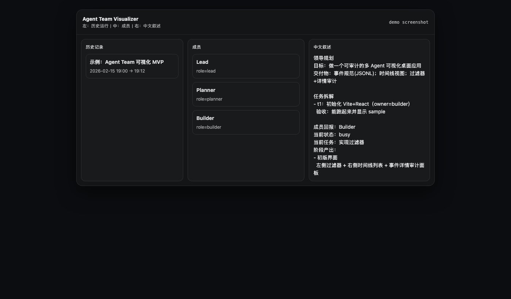

# Agent Team Visualizer

A desktop app to **see what your agent team did** (in Chinese), without the black box.

- Left: run history (projects)
- Middle: team members
- Right: natural-language Chinese narrative (leader plan, task breakdown, stage outcomes)

> Intern-friendly: clean scope, strong engineering story (schema design, observability, desktop packaging).

## Screenshot



## What You Get

- **Leader plan (中文)**: goals, deliverables, milestones
- **Task breakdown (中文)**: who owns what + acceptance criteria
- **Per-agent status (中文)**: current state, instructions received, stage outputs
- **Run history**: switch between past runs (by `run_id` + `run_title_zh`)
- **Auditability**: internally uses JSONL events, but UI shows only Chinese narratives

## Quick Start (Dev)

Web UI:

```bash
npm install
npm run dev
```

Desktop (Electron) UI:

```bash
npm install
npm run desktop:dev
```

## Data: JSONL Event Log (You don’t see JSON in UI)

You feed the app with JSONL (one JSON per line). The app renders:

- `run_id` + `run_title_zh`: identify and name a run (shown in the left history list)
- `agent.role`: set leader as `lead`
- `meta.leader_plan`: leader’s Chinese plan
- `meta.task_breakdown_zh`: task decomposition list
- `artifact.summary_zh`: stage outcomes per agent (preferred)

Schema reference: `docs/event-schema.md`

### Minimal example

```json
{"id":"evt_1","ts":"2026-02-15T12:00:00+08:00","run_id":"run_001","run_title_zh":"BTC/USDT 盘口策略迭代","type":"message","stage":"planning","from":{"id":"lead","name":"Lead","role":"lead"},"to":{"id":"planner","name":"Planner","role":"planner"},"content":"Define plan","content_zh":"目标：做可复现实验；输出：回测+执行风控+审计日志","channel":"instruction","meta":{"leader_plan":{"goal_zh":"做一套可复现的策略迭代流水线","deliverables_zh":["回测","实盘执行风控","审计日志"],"milestones_zh":[{"name":"MVP 跑通","done":false}]}}}
```

## Releases (Mac / Windows)

This repo is set up for **tag-based releases** via GitHub Actions.

1) Update version + commit
2) Create a tag:

```bash
git tag v0.1.0
git push origin v0.1.0
```

3) GitHub Actions will build and upload installers to the Release page:

- macOS: `.dmg` / `.zip`
- Windows: `.exe` (NSIS) / `.zip`

## Roadmap

- File import (`.jsonl`) instead of paste
- Better thread view (pure Chinese summaries)
- Agent status event stream (`agent_status`) from orchestrator
- Export Chinese report (HTML/PDF)

## License

MIT
